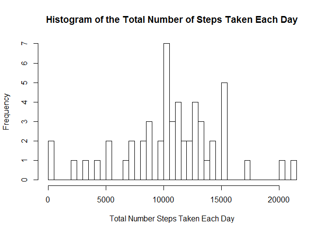
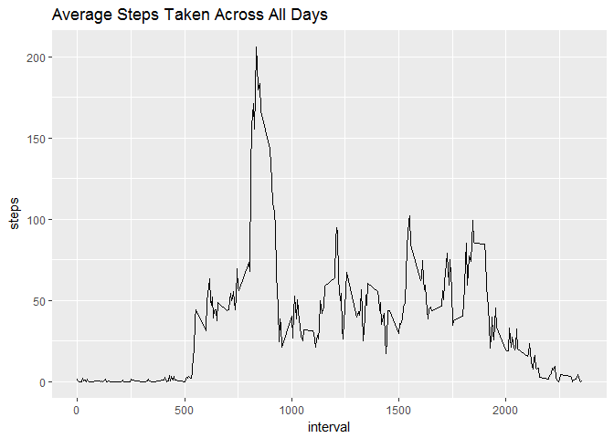
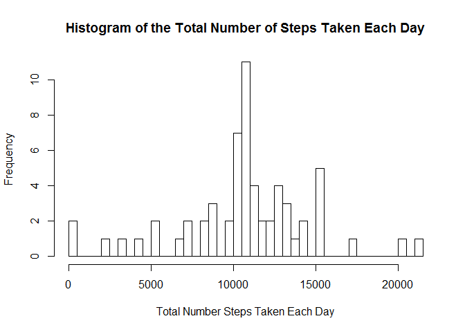
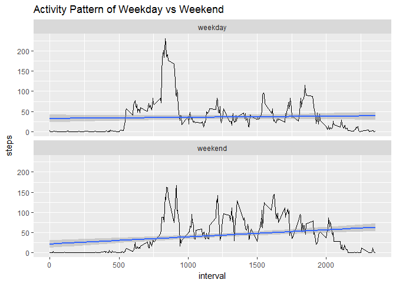

# Reproducible Research: Peer Assessment 1
Chng Yan Hao  
27 Feb 2017  

## 1. Loading and preprocessing the data


```r
url <- "https://d396qusza40orc.cloudfront.net/repdata%2Fdata%2Factivity.zip"
download.file(url, destfile = "amd.zip", mode = "wb")
timedl <- date()
unzip("amd.zip")
activity <- read.csv("activity.csv", header = TRUE, stringsAsFactors = FALSE)
```

The url where I got the file was https://d396qusza40orc.cloudfront.net/repdata%2Fdata%2Factivity.zip.  
The time I have downloaded it was Mon Feb 27 03:48:25 2017  
The zip file was unzipped and stored as "activity".  

Let's have a glimpse at the data.

```r
dim(activity)
```

```
## [1] 17568     3
```

```r
str(activity)
```

```
## 'data.frame':	17568 obs. of  3 variables:
##  $ steps   : int  NA NA NA NA NA NA NA NA NA NA ...
##  $ date    : chr  "2012-10-01" "2012-10-01" "2012-10-01" "2012-10-01" ...
##  $ interval: int  0 5 10 15 20 25 30 35 40 45 ...
```

```r
head(activity)
```

```
##   steps       date interval
## 1    NA 2012-10-01        0
## 2    NA 2012-10-01        5
## 3    NA 2012-10-01       10
## 4    NA 2012-10-01       15
## 5    NA 2012-10-01       20
## 6    NA 2012-10-01       25
```

```r
summary(activity$steps)
```

```
##    Min. 1st Qu.  Median    Mean 3rd Qu.    Max.    NA's 
##    0.00    0.00    0.00   37.38   12.00  806.00    2304
```

```r
mean(is.na(activity$steps))
```

```
## [1] 0.1311475
```

## 2. What is mean total number of steps taken per day?

13% of the "steps" were "NA".  
Let's only consider the 87% of data when computing the mean and leave the imputing to part 4.  


```r
activityCC <- na.omit(activity)
stepsperday <- with(activityCC, tapply(steps, date, sum))
hist(stepsperday, breaks = 60, 
     xlab = "Total Number Steps Taken Each Day", 
     main = "Histogram of the Total Number of Steps Taken Each Day")
```

<!-- -->

```r
stepsperday_mean <- mean(stepsperday)
stepsperday_median <- median(stepsperday)
```


- Mean was 10766.
- Median was 10765.

## 3. What is the average daily activity pattern?


```r
library(ggplot2)
dailypattern <- data.frame("steps" = with(activityCC, tapply(steps, interval, mean)))
dailypattern$interval <- as.numeric(rownames(dailypattern))

g <- ggplot(dailypattern, aes(interval, steps))
g + geom_line() + labs(title = "Average Steps Taken Across All Days")
```

<!-- -->

```r
maxsteps <- dailypattern[dailypattern$steps == max(dailypattern$steps),]
maxsteps_time <- substr(as.POSIXct(sprintf("%04.0f", maxsteps$interval), format='%H%M'), 12, 16)
```

The maximum number of steps were 206 steps at 08:35 hrs.  

## 4. Imputing missing values


```r
NAs <- sum(is.na(activity))
splitactivity <- split(activity, activity$date)
n <- names(table(activity[is.na(activity),]$date))
for (i in n){splitactivity[[i]]$steps <- dailypattern$steps}
NEWactivity <- do.call("rbind", splitactivity)
NEWstepsperday <- with(NEWactivity, tapply(steps, date, sum))

hist(NEWstepsperday, breaks = 60, 
     xlab = "Total Number Steps Taken Each Day", 
     main = "Histogram of the Total Number of Steps Taken Each Day")
```

<!-- -->

```r
NEWstepsperday_mean <- mean(NEWstepsperday)
NEWstepsperday_median <- median(NEWstepsperday)
```
There were 8 dates with NAs in its "steps" data contributing to 2304 NAs.  
These dates' NAs were imputed with the daily pattern calculated in part 2.  
The mean of the new data remains the same and its median has became slightly larger.

- Original mean: 10766  
- New mean: 10766  
- Original median: 10765  
- NEW median: 10766  


## 5. Are there differences in activity patterns between weekdays and weekends?

Create a new factor variable in the dataset with two levels -- "weekday" and "weekend" indicating whether a given date is a weekday or weekend day.


```r
NEWactivity$wday <- weekdays(as.Date(NEWactivity$date))
weekend <- c("Saturday", "Sunday")
NEWactivity$day <- "weekday"
NEWactivity$day[NEWactivity$wday %in% weekend] <- "weekend"

str(NEWactivity)
```

```
## 'data.frame':	17568 obs. of  5 variables:
##  $ steps   : Named num  1.717 0.3396 0.1321 0.1509 0.0755 ...
##   ..- attr(*, "names")= chr  "0" "5" "10" "15" ...
##  $ date    : chr  "2012-10-01" "2012-10-01" "2012-10-01" "2012-10-01" ...
##  $ interval: int  0 5 10 15 20 25 30 35 40 45 ...
##  $ wday    : chr  "Monday" "Monday" "Monday" "Monday" ...
##  $ day     : chr  "weekday" "weekday" "weekday" "weekday" ...
```

A panel plot containing a time series plot (i.e. type = "l") of the 5-minute interval (x-axis) and the average number of steps taken, averaged across all weekday days or weekend days (y-axis).


```r
NEWdailypattern <- aggregate(steps ~ interval + day, NEWactivity, mean)

g <- ggplot(NEWdailypattern, aes(interval, steps))
g + geom_line() + geom_smooth(method = "lm") + facet_wrap(~day, nrow = 2) + labs(title = "Activity Pattern of Weekday vs Weekend")
```

<!-- -->

